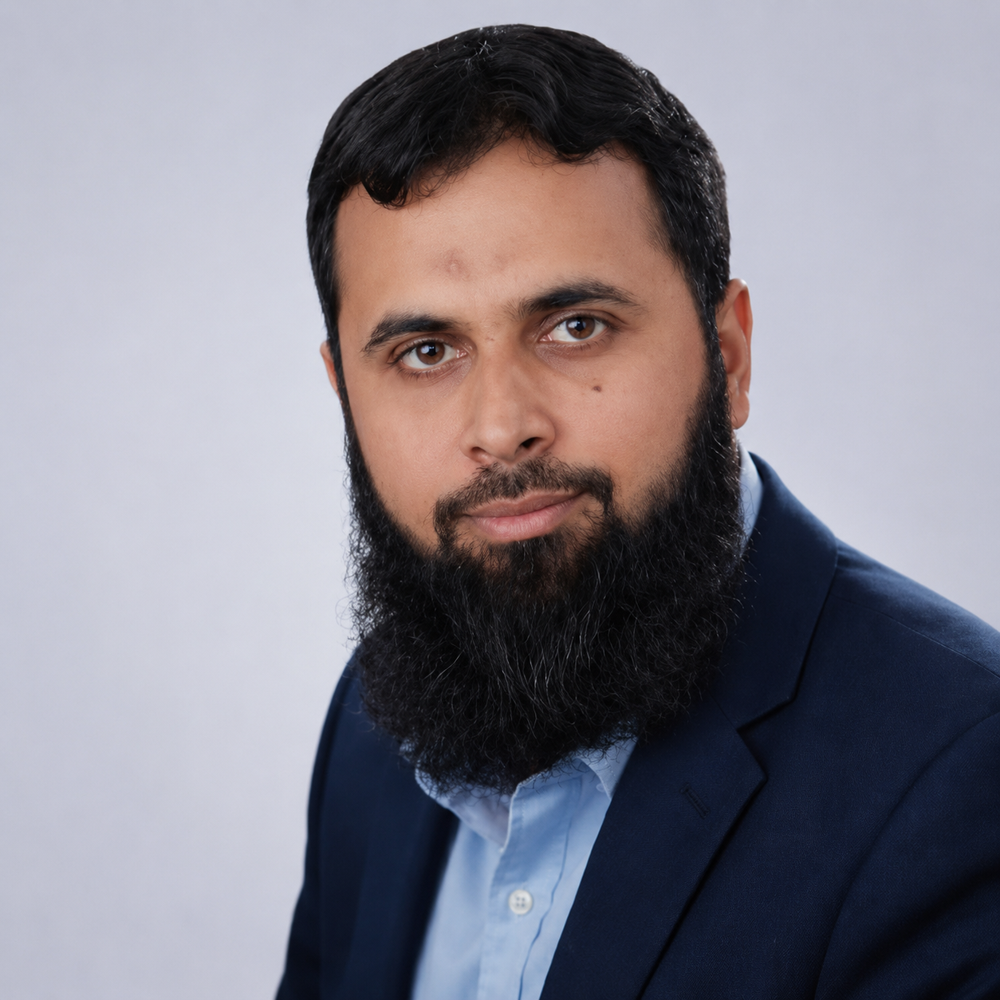

  

# SHAKOOR HUSSAIN ATTARI

## Lead Software Engineer | Full-Stack Architect | 15+ Years

**Phone:** +971 50 806 6735
**Email:** <binmushtaq@gmail.com>
**LinkedIn:** [linkedin.com/in/shakoorattari](https://www.linkedin.com/in/shakoorattari/)
**Location:** Sharjah, UAE

---

## Professional Summary

Results-driven Lead Software Engineer and Application Architect with 15+ years of enterprise software delivery experience across the UAE public sector. Deep expertise in .NET / ASP.NET Core, Angular, RESTful API design, OAuth 2.0 / OIDC, multi-tenant IAM, and Azure DevOps CI/CD. Proven track record of owning end-to-end solution architecture — from requirements analysis through production operations — for mission-critical government platforms serving multiple Sharjah entities. Passionate about clean code, developer experience, and leveraging AI tooling to accelerate engineering velocity.

---

## Core Competencies

| Category | Stack |
|----------|-------|
| **Backend** | ASP.NET Core / .NET 8, 10 · .NET Web APIs & MVC |
| **Frontend** | Angular 7–18 (TypeScript) · SPA & Lazy-Loading Modules |
| **Identity & Security** | OAuth 2.0 / OIDC / JWT · UAE PASS & Azure Entra ID SSO · Multi-Tenant IAM · RBAC & Scoped Authorization |
| **Databases** | Microsoft SQL Server · Oracle DB & PL/SQL |
| **DevOps & CI/CD** | Azure DevOps & CI/CD · GitHub Actions · Jenkins |
| **Real-Time & Caching** | SignalR & Real-Time Apps · Redis Distributed Cache |
| **Testing** | Playwright & Test Automation · HP LoadRunner · Selenium |
| **Integration** | Microservices & REST APIs · MS Graph APIs |
| **Low-Code** | OutSystems · Service & Integration Studio |
| **Methodology** | Agile / Scrum / Kanban · JIRA · TFS |
| **AI Tooling** | MCP Servers · AIRIA Orchestration · RAG · Engineering Workflow Automation |

---

## Professional Experience

### Lead Software Engineer / Application Architect — Sharjah Digital Department (SDD)
*Jan 2023 – Present · formerly Department of eGovernment*

Engineering lead and organization-wide technical authority responsible for a team of 8 engineers (2 front-end, 6 full-stack), cross-organizational architectural consultancy, and end-to-end ownership of SDD's enterprise platform portfolio. Primary technical point of contact for G2G (Government-to-Government) service integrations, vendor engagements, and security compliance initiatives in partnership with Sharjah's Cyber Security and IT Security departments.

**People Leadership & Delivery**

- Lead, mentor, and conduct performance reviews for a cross-functional team of 8 engineers; define sprint goals, capacity plans, and individual growth paths aligned with organizational OKRs.
- Own delivery governance end-to-end — from requirements decomposition and architecture review through release sign-off — using Azure DevOps boards, pipelines, and quality gates.
- Drive CI/CD maturity across SDD: standardized pipeline templates, automated code-quality gates (SonarQube), branch strategies, and environment promotion workflows, reducing deployment risk and cycle time.

**Architectural Consultancy & G2G Integration**

- Organization-wide architectural consultant across multiple concurrent projects — advising on technology selection, integration patterns, data contracts, and system boundaries.
- Lead architecture and delivery of G2G service integrations: inter-agency API contracts, secure data-exchange protocols, and compliance requirements across Sharjah government entities.
- Manage end-to-end vendor relationships and technical due-diligence: evaluating third-party platforms, negotiating integration approaches, and overseeing vendor delivery against agreed SLAs.
- Designed multi-tenant, API-first architectures with SSO (UAE PASS, Azure Entra ID), RBAC, and audit-ready security controls across all platforms.
- Defined reusable integration patterns (REST, event-driven, webhook) and platform components adopted org-wide.

**Cyber Security & IT Security Alignment**

- Primary engineering liaison with Sharjah Cyber Security Department and IT Security teams — translating security policies into actionable architectural controls and ensuring full compliance across the application estate.
- Embedded security-by-design principles across all platforms: threat modelling, least-privilege RBAC, secure-by-default API configurations, secrets management, and audit-log readiness.
- Led OAuth 2.0 / OIDC implementation (PKCE, token validation, audience scoping) and UAE PASS / Azure Entra ID SSO federation in alignment with Sharjah's identity governance standards.
- Conducted security architecture reviews for new initiatives and vendor-supplied components.

**Azure DevOps Server Administration & CI/CD Platform Ownership**

- Sole owner and administrator of SDD's on-premises Azure DevOps Server 2022.2 installation — initial environment setup, upgrades, capacity planning, and ongoing platform health.
- Configured and maintain 20+ team projects with tailored process templates, repository policies, branch protection rules, and work-item configurations.
- Provisioned and manage dozens of self-hosted build agents across multiple VM environments; own agent pool strategy and pipeline queue optimization.
- Authored standardized organization-wide CI/CD pipeline templates (YAML) covering build, test, code-quality (SonarQube), artefact publishing, and multi-stage environment promotion.

**AI Tooling — MCP Servers & Agentic Workflow Engineering**

- Architected and built a suite of Model Context Protocol (MCP) servers to integrate AI agents with SDD's internal systems, enabling context-aware automation across engineering and operational workflows.
- **Azure DevOps MCP Server** — exposes on-premises Azure DevOps Server 2022.2 as a structured context source for AI agents (projects, repos, pipelines, work items, build history); purpose-built equivalent of Microsoft's public Azure DevOps MCP with SDD-specific security scoping.
- **TransLynk MCP Server** — scans application source code to extract all localization strings, labels, UI text, and tooltips; auto-generates English and Arabic translations; diffs against existing TransLynk project translations; and upserts only net-new entries.
- **Active Directory MCP Server** — structured, query-able interface into on-premises Active Directory, enabling identity lookups, group membership queries, and organizational context resolution within agentic workflows.
- **AIRIA Orchestration Platform** — engineering and configuration of AI agents, RAG pipelines, security guardrails, and intent-routing models within SDD's enterprise AIRIA environment.
- **OnePortal AI Assistant** — context-aware chatbot within OnePortal using AIRIA RAG pipelines, ingesting GRC policies, HR policies, IT/technical help content, and the OnePortal service catalogue.

---

### OnePortal IAM — Identity & Access Management / Authorization Server
*2024 – Present · Application Architect & Technical Lead*
**Stack:** .NET 8, ASP.NET Core, OAuth 2.0/OIDC, Azure Entra ID, UAE PASS

- Defined the overall IAM architecture: multi-tenant OAuth 2.0 / OIDC flows (Authorization Code, Client Credentials, PKCE, On-Behalf-Of), token issuance strategy, audience validation, and secure API protection patterns adopted across all SDD services.
- Established UAE PASS and Azure Entra ID SSO federation design — specifying identity propagation contracts, trust boundaries, and integration standards for consuming applications.
- Authored architectural guidelines for tenant-aware RBAC with fine-grained scope definitions; conducted structured code reviews to ensure implementation fidelity.
- Guided the development team on threat modelling, secure coding practices, and OAuth edge-case handling.

---

### OnePortal — Unified Digital Workplace & Government Service Hub
*2024 – Present · Application Architect & Technical Lead*
**Stack:** .NET Core, Angular, Microsoft 365 (Teams / Planner / To Do), MS Graph API

- Defined the end-to-end solution architecture: module boundaries, API contracts, integration patterns, data ownership, and security-by-design controls.
- Architected core platform modules — Service Catalog, Knowledge Hub, Microsoft 365 collaboration integrations (Teams / Planner / To Do via MS Graph API), and announcement engine.
- Designed workflow automation patterns for service requests, multi-level approval routing, and task orchestration; established least-privilege API access standards for all MS Graph integrations.
- Led architectural enhancements and governed quality through structured code reviews; provided technical direction on Angular module design, lazy-loading strategy, and API consumption patterns.
- Defined reporting and analytics dashboard architecture for KPI visibility on service adoption and usage trends.

---

### SDD Announce — Multi-Tenant Announcement & Campaign Orchestration Platform
*2023 – Present · Senior Software Engineer (Full Stack)*
**Stack:** .NET 8, ASP.NET Core Web APIs, Angular 14, SMTP Relay, MS SQL Server

- Designed and delivered a tenant-aware announcements platform with a rich content editor, configurable templates, and department-based targeting.
- Implemented customisable multi-level approval workflows per announcement type and organizational unit; enabled scheduling and automated SMTP distribution.
- Hardened platform for enterprise operations: auditability, RBAC, extensible configuration, and maintainable modular architecture.

---

### AI Tooling Suite — MCP Servers & AIRIA Orchestration
*2024 – Present · Senior Software Engineer (Full Stack)*
**Stack:** .NET, MCP Server SDK, Azure DevOps REST API, LDAP / Active Directory, AIRIA Platform

- Designed and delivered a suite of MCP servers bringing SDD's internal systems into AI agent context — Azure DevOps Server, Active Directory, and the TransLynk localization platform.
- AIRIA Orchestration: engineered AI agents, RAG pipelines, security guardrails, and intent-routing models within SDD's enterprise AIRIA environment for policy-compliant agentic automation.

---

### Senior Full-Stack Developer — Department of eGovernment (now Sharjah Digital Department)
*2018 – Dec 2022*

**Legal Department of Sharjah — Public Web Portal & CMS** *(Sep 2022 – Dec 2022)*
.NET Core 6, C#, Web APIs, Angular 14, MS SQL Server — multi-role CMS for public-facing content management, training application bookings, and admin approval workflows; Angular lazy-loading modules; SEO best practices.

**Announcements Management — Enterprise Notification & Engagement Platform** *(Apr 2022 – Aug 2023)*
.NET 6, C#, Web APIs, SignalR, Angular 14, OneSignal, MS SQL Server — role-based announcement platform with rich text/graphics editor, multi-level approval workflows, and OneSignal desktop push notifications.

**Meeting Rooms Booking System — Enterprise Room Management** *(Aug 2021 – 2022)*
.NET Core 6, C#, Web APIs, Angular 12, EWS, Outlook Add-in, MS SQL Server — multi-role room booking platform; custom Outlook task-pane add-in with real-time free/busy validation; Windows Service to synchronise Exchange calendar events via EWS subscription events.

**Sessions Management System — Parliamentary / Committee Session Platform** *(Sep 2020 – Jan 2021)*
.NET 4.8, C#, Web APIs, SignalR, Angular 9, MS SQL Server — multi-role platform managing session agendas, attendance, committee requests (leave/speak), and real-time voting; fully asynchronous server–client communication using SignalR.

**Event Management Solution — Government Event Orchestration Platform** *(Mar 2019 – Oct 2019)*
.NET 4.5, C#, MVC, SignalR, Selenium, MS SQL Server — multi-module event platform (registrations/approvals, VIP management, Majlis bookings, live chat, large-file sharing, audit logging); Selenium-based parallel test automation framework with web UI; HP LoadRunner performance test scripts.

---

### Full-Stack Software Engineer — Emaratech, Dubai
*2014 – 2019*

**Smart Channels — UAE Visa Application Portal (GDRFA)** *(Apr 2018 – Mar 2019)*
OutSystems (Service Studio / Integration Studio), .NET 4.5, C#, Oracle DB, Selenium — full-stack delivery of the GDRFA visa application portal; EIDA biometric verification and OCR-based passport scanning to pre-fill application forms.

**Vision eForm — UAE Visa Processing Platform** *(2016 – 2018)*
.NET 4.5, C#, MVC, ASP.NET, Redis Cache, Oracle DB, Selenium, SonarQube, Jenkins — features across the visa processing pipeline (document management, multi-channel payments, approval routing, automated visa generation via Windows Service); Redis distributed cache for session management; SonarQube and Jenkins for CI and code quality.

**Vision Tracker — ETL Monitoring Dashboard** *(2014 – 2016)*
.NET 4.5, ASP.NET, Web APIs, jQuery Charts, Oracle DB — BI dashboard giving operations real-time visibility into ETL pipeline failures and application statuses; interactive charts, filterable data tables, and reporting module with Excel/PDF export.

---

### Application & IT Support Engineer — eGates / Smart Gates · Emaratech, Sharjah
*2007 – 2013*

Provided application and field support for Emaratech's biometric eGate systems at Dubai and Sharjah airports, Ajman, and UAQ immigration points — covering passport verifiers, facial-capture cameras, and iris scanners.

---

## Education

- **B.Sc. Computer Science (4-Year Honours)** — Allama Iqbal Open University, Pakistan · 2002 – 2006
- **F.Sc. Computer Science (Pre-Engineering)** — Govt. Murray College, Sialkot, Pakistan · 2000 – 2002

---

## Certifications & Professional Development

- **MCTS — .NET 4.0 Web Applications** · Microsoft
- **MCTS — SharePoint 2010 / 2013** · Microsoft
- **Angular Development Training (v9–17)** · Professional Training
- **OutSystems Web Application Development** · OutSystems
- **Flutter — Cross-Platform App Development (iOS, Android, Web, Desktop)** · Professional Training
- **Splunk — Searching, Monitoring & Analysing Machine-Generated Data** · Professional Training

---

## Languages

| Language | Proficiency |
|----------|-------------|
| **English** | Professional Proficiency |
| **Urdu** | Native |
| **Arabic** | Conversational |
| **Punjabi** | Fluent |
