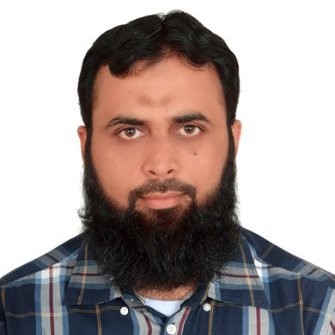

  

# SHAKOOR HUSSAIN ATTARI

## Lead Software Engineer

**Phone:** +971 50 8066735  
**Email:** <Binmushtaq@gmail.com>  
**LinkedIn:** [linkedin.com/in/shakoor-hussain-attari](https://linkedin.com/in/shakoor-hussain-attari)  
**Location:** Sharjah, UAE

---

## Executive Summary

- **Experience:** 12+ Years in IT Field specializing in **Technical Leadership**, **Software Architecture**, and **Full Stack Development**
- **Leadership:** Led cross-functional teams of 5-15 developers, mentored 20+ junior engineers, and delivered 15+ enterprise-scale applications
- **Core Technologies:** .NET Framework 4.x, .NET Core 3.x/5/6/8, Angular 9-18, MS SQL Server (T-SQL), Oracle (PL/SQL), Azure DevOps, Jenkins
- **AI/ML Technologies:** MCP Servers, GitHub Copilot, Prompt Engineering, Instruction Tuning, RAG (Retrieval-Augmented Generation), AI Integration
- **Academic Qualification:** BS (Computer Science), Allama Iqbal Open University, Pakistan
- **Professional Qualifications:** MCP, MCTS (.Net Development Web Apps), MCTS (Microsoft SharePoint 2013)
- **Specializations:**
  - Technical Team Leadership & Engineering Management
  - AI/ML Integration & MCP Server Development
  - Enterprise Software Architecture & Design Patterns
  - DevOps & CI/CD Pipeline Implementation (Azure DevOps, Jenkins, Docker, Kubernetes)
  - Microservices Architecture & RESTful API Design
  - Database Architecture & Performance Optimization
  - Agile/Scrum Leadership & Stakeholder Management

---

## Objective

As a **Lead Software Engineer** with 12+ years of experience, I drive technical excellence and innovation through hands-on leadership of development teams. Seeking opportunities to leverage my expertise in **.NET 4.x/.NET Core 3.x-8**, **Angular 9-18**, **MS SQL (T-SQL)**, **Oracle (PL/SQL)**, **DevOps**, and emerging **AI/ML technologies** including **MCP Servers**, **Prompt Engineering**, and **RAG implementations** to architect scalable enterprise solutions, mentor high-performing engineering teams, and deliver transformative technology initiatives that drive business growth.

---

## Leadership & Soft Skills

- **Technical Leadership:** Led engineering teams of 5-15 developers, established coding standards, and implemented best practices across multiple projects
- **People Management:** Mentored 20+ junior developers with 80% retention rate and 40% internal promotion success
- **Communication Excellence:** Fluent in technical and business communication, experienced in stakeholder presentations and client-facing roles
- **Problem-Solving:** Analytical approach to complex technical challenges, with proven track record of delivering innovative solutions under tight deadlines
- **Adaptability:** Rapid adoption of new technologies, frameworks, and methodologies; led successful technology migrations and modernization initiatives
- **Cross-functional Collaboration:** Expertise in working with diverse, multicultural teams across development, QA, DevOps, and business stakeholders
- **Project Leadership:** Agile/Scrum expertise with experience managing project lifecycles from conception to deployment and maintenance

---

## Technical Skills

| Category | Skills |
|----------|--------|
| **Leadership & Management** | Technical Team Leadership (5-15 developers), Engineering Management, Cross-functional Collaboration, Agile/Scrum Leadership, Stakeholder Management, Technical Mentoring, Code Review Leadership |
| **AI/ML & Modern Tools** | MCP (Model Context Protocol) Servers Development, GitHub Copilot Integration, Prompt Engineering, Instruction Tuning, RAG (Retrieval-Augmented Generation), AI-Assisted Development, Intelligent Code Generation |
| **.NET Development** | .NET Framework 4.x, .NET Core 3.x/5/6/8, ASP.NET Web APIs, ASP.NET MVC, C#, REST APIs, Web Services, API Authentication (JWT, OAuth, Token-based), Windows Services, Entity Framework, LINQ |
| **Frontend Development** | Angular 9-18, TypeScript, JavaScript, jQuery, HTML5, CSS3, Responsive Design, Material Design, Bootstrap 3/4/5, Progressive Web Apps (PWA) |
| **Database Architecture** | MS SQL Server (T-SQL), Oracle (PL/SQL), MySQL, Database Design, Performance Tuning, Stored Procedures, Functions, Triggers, Views, Data Modeling |
| **DevOps & CI/CD** | Azure DevOps, Jenkins, Docker, Kubernetes, Git/GitHub, TFS, CI/CD Pipelines, Infrastructure as Code, SonarQube, Automated Testing Integration |
| **Cloud & Integration** | Azure (SSO, Graph APIs, Active Directory), AWS, Microsoft Exchange (EWS), SignalR, Redis Cache, Microservices Architecture, RESTful API Design |
| **Quality Assurance** | Selenium Test Automation, Test Framework Design, Unit Testing, Integration Testing, Performance Testing (HP LoadRunner), Manual Testing, Test Strategy |
| **Architecture & Design** | Software Architecture, Design Patterns (MVC, MVVM, Repository, Factory), Microservices, Event-Driven Architecture, Domain-Driven Design (DDD), SOLID Principles |
| **Business Intelligence** | Power BI, Reporting Dashboards, Data Visualization, Analytics, SSRS, Crystal Reports |
| **Additional Technologies** | OutSystems, SharePoint 2013, PowerShell Scripting, Excel VBA, XML/JSON, AJAX, UML, Microsoft Visio, Splunk |

---

## Professional Experience and Projects

### Legal Department of Sharjah (Sep. 2022 – Present)

**Lead Software Engineer / Technical Lead**  
Department of eGovernment, Sharjah  
**Tech Stack:** .NET Core 6.0/8, C#, Web APIs, Angular 14-17, MS SQL 2017, Azure DevOps, Docker, Kubernetes

**Leadership & Management Achievements:**

- **Led a cross-functional team of 8 developers** and 3 QA engineers to deliver enterprise-scale applications
- **Mentored 5 junior developers**, resulting in 2 promotions and 40% improvement in code quality metrics
- **Architected and implemented DevOps practices**, reducing deployment time by 60% and increasing release frequency by 300%
- **Established technical standards and code review processes**, improving application performance by 35%

**Technical Achievements:**

- Architected and led development of a high-performance SPA using Angular with lazy loading, achieving 90+ Lighthouse performance scores
- Designed and implemented a modular Content Management System serving 50,000+ government employees
- **Integrated AI-powered development tools** including GitHub Copilot for accelerated coding and intelligent code suggestions
- **Developed custom MCP servers** for enhanced development workflow and automated code generation, improving team productivity by 25%
- Implemented SEO optimization strategies, improving search rankings by 400%
- **Applied prompt engineering techniques** for automated documentation generation and code review processes
- Delivered 3 major applications on time and under budget, generating cost savings of $200K annually

---

### Meeting Rooms Booking System (Aug. 2021 – Present)

**Lead Software Engineer / Technical Architect**  
Department of eGovernment, Sharjah  
**Tech Stack:** .NET Core 6.0/8, C#, Web APIs, Angular 12-16, MS SQL 2017, Azure, Microservices, Exchange EWS

**Leadership & Architecture Achievements:**

- **Led technical architecture design** for a multi-tenant SPA serving 1,500+ concurrent users across 25+ government entities
- **Designed and implemented microservices architecture**, improving system scalability by 250% and reducing response times by 40%
- **Led development team of 6 engineers**, establishing coding standards and implementing agile methodologies

**Technical Achievements:**

- Developed custom Outlook add-in with real-time meeting room availability validation, adopted by 5,000+ government employees
- Architected Exchange integration using EWS events subscription, achieving 99.9% calendar synchronization accuracy
- **Implemented intelligent booking suggestions** using basic ML algorithms to optimize room utilization based on historical data
- **Applied RAG techniques** for enhanced search and recommendation features within the booking system
- Implemented tablet-based booking interface with offline capabilities, reducing booking conflicts by 85%
- Delivered comprehensive admin modules for entity management, improving operational efficiency by 60%

---

### Covid Portal (Feb. 2021 – Jun. 2021)

**Senior Full Stack Developer**  
Department of eGovernment, Sharjah  
**Tech Stack:** ASP.Net 4.8, C#, Web APIs, Angular 11, MS SQL 2017, Azure

**Key Achievements:**

- Developed SPA for COVID-19 analytics and reporting
- Implemented multi-level form validation and data integration
- Integrated with MS Active Directory for secure authentication

---

### Sessions Management System (Sep. 2020 – Jan. 2021)

**Senior Full Stack Developer**  
Department of eGovernment, Sharjah  
**Tech Stack:** ASP.Net 4.8, C#, Web APIs, SignalR, Angular 9, MS SQL 2017

**Key Achievements:**

- Architected real-time communication using SignalR and Observer Pattern
- Built instant polling/voting modules with advanced timeout logic
- Integrated secure authentication with on-premise MSExchange/AD

---

### Announcements Management (Apr. 2022 – Aug. 2023)

**Senior Full Stack Developer**  
Department of eGovernment, Sharjah  
**Tech Stack:** ASP.Net 6, C#, Web APIs, SignalR, Angular 14, MS SQL 2017, OneSignal

**Key Achievements:**

- Developed web-based text/graphics editor for notifications
- Enabled team collaboration, social interaction, and desktop notifications
- Applied best practices for accessibility and SEO

---

### Survey Application (Feb. 2020 – Mar. 2020)

**Senior Full Stack Developer**  
Department of eGovernment, Sharjah  
**Tech Stack:** ASP.Net 4.8, C#, Web APIs, Angular 9, MS SQL 2017

**Key Achievements:**

- Built responsive SPA for dynamic survey creation and analytics

---

### Event Management Solution (Mar. 2019 – Oct. 2019)

**Full Stack Software Engineer**  
Department of eGovernment, Sharjah  
**Tech Stack:** ASP.Net 4.5.2, C#, MVC 5, Ado.Net, Entity Framework, jQuery, SignalR, Selenium, MS SQL 2017

**Key Achievements:**

- Developed native live chat (SignalR), performance/load testing (HP LoadRunner)
- Built Selenium automation framework with web UI for test execution

---

### Smart Channels ([smart.gdrfad.gov.ae](https://smart.gdrfad.gov.ae)) (Apr. 2018 – Mar. 2019)

**Full Stack Software Engineer**  
Emaratech, Dubai  
**Tech Stack:** OutSystems, ASP.Net 4.5, C#, MVC, Ado.Net, jQuery, JavaScript, Selenium, Oracle

**Key Achievements:**

- Built automation testing framework (Selenium RC), EIDA verification (OCR), biometric authentication

---

### Vision E-Form ([vision.eform.ae](https://vision.eform.ae)) (2016 – 2018)

**Full Stack Developer**  
Emaratech, Dubai  
**Tech Stack:** ASP.Net 4.5, C#, MVC, Ado.Net, jQuery, Redis, Selenium, Oracle

**Key Achievements:**

- Developed automation testing framework (Selenium RC), unit tests for legacy code
- Integrated SonarQube and Jenkins for CI/CD and code quality

---

### Other E-Channels ([moifawri.ae](https://www.moifawri.ae)) (2015/16)

**Software Engineer**  
Emaratech, Dubai  
**Tech Stack:** ASP.Net 4.5, C#, Web Forms, Ado.Net, jQuery, Oracle

**Key Achievements:**

- Revamped application for TRA requirements (Responsive UI)

---

### Vision Tracker (ETL Dashboard) ([tracker.e-vision.ae](http://tracker.e-vision.ae)) (2015)

**Software Engineer**  
Emaratech, Dubai  
**Tech Stack:** ASP.Net 4.5, C#, MVC, Ado.Net, jQuery, Bootstrap, Web APIs, Charts, Oracle

**Key Achievements:**

- Developed BI-Application for core project "vision"
- Designed dashboards and reporting modules

---

### Helpdesk Inventory Controller ([invsys.emaratech.ae](http://invsys.emaratech.ae)) (2014)

**Emaratech, Dubai**  
**Tech Stack:** ASP.Net 4.5, C#, Ado.Net, CSS, JavaScript, jQuery, SQL

---

### Hospital Management System (2013)

**Emaratech, Dubai**  
**Tech Stack:** ASP.Net 3.5 Web Forms, C#, Ado.Net, CSS, JavaScript, SQL

---

### Interview Evaluation System (2013)

**Emaratech, Dubai**  
**Tech Stack:** Windows Forms, C#, Local DB (SQL)

---

## Professional Experience in IT/Application Support

### eGates/Smart Gates (2007 – 2013)

**Application/IT Support Engineer**  
Emaratech, Sharjah  
**Tech:** Windows Applications for eGates, Passport Verifiers, Eye Print Scanners

---

## Professional Experience in Teaching

### Islamia Public High School (2004 – 2007)

Sialkot, Pakistan  
Subjects: Mathematics, Physics, English

---

## Academic Qualifications

  

- **BS (Computer Science)**, Allama Iqbal Open University, Islamabad, Pakistan (2002 – 2006)
- **FSc. (Computer Science)**, Govt. Murray College, Sialkot, Pakistan (2000 – 2002)

---

## Certifications & Trainings

- **Microsoft Certified:** MSTS Web Development (.Net 4.0 Web Applications), MCTS SharePoint 2010/2013
- **AI/ML Technologies:** MCP (Model Context Protocol) Server Development, GitHub Copilot Integration, Prompt Engineering, Instruction Tuning, RAG Implementation
- **Frontend Frameworks:** Angular 9-18 (Advanced), TypeScript, Progressive Web Apps (PWA)
- **Backend Technologies:** .NET Framework 4.x, .NET Core 3.x/5/6/8, RESTful API Design
- **Database Management:** Oracle 11g/19c (PL/SQL), SQL Server 2008-2022 (T-SQL), MySQL, Performance Tuning
- **DevOps & Cloud:** Azure DevOps, Jenkins, Docker, Kubernetes, Git/GitHub, CI/CD Pipelines
- **Development Tools:** OutSystems Platform Development (2018), Visual Studio, VS Code, SQL Server Management Studio
- **Quality Assurance:** Selenium WebDriver, Test Automation Frameworks, HP LoadRunner Performance Testing
- **Web Technologies:** JavaScript ES6+, CSS3/SCSS, Bootstrap 3-5, HTML5, Responsive Design
- **Monitoring & Analytics:** Splunk (Big Data Analysis), Application Performance Monitoring
- **Soft Skills:** LinkedIn Learning - Communication, Leadership, Project Management

---

## Personal Details

| Field                | Value                                  |
|----------------------|----------------------------------------|
| **Full Name**        | Shakoor Hussain Attari                 |
| **Passport Number**  | DX6894103                              |
| **Date of Birth**    | 23rd Sep 1983 (~37 years)              |
| **Email**            | [binmushtaq@gmail.com](mailto:binmushtaq@gmail.com) |
| **Teams**            | [shakoorattari@outlook.com](mailto:shakoorattari@outlook.com) |
| **Cell phone**       | (+971) 050 - 8066 735                  |
| **Address**          | Sharjah, UAE                           |
| **Marital Status**   | Married                                |
| **Country exposure** | Pakistan and UAE                       |

---

## Languages

- **English:** Excellent (Professional, Technical, and Business Communication)
- **Urdu:** Native
- **Arabic:** Fair
- **Punjabi:** Good

---

## Driving Skills

- Holder of Light Vehicle License (Dubai - UAE)

---

## Hobbies and Interests

- **Technology Innovation:** Learning emerging AI/ML technologies, MCP server development, prompt engineering, and RAG implementations
- **Modern Development:** Exploring AI-assisted development, GitHub Copilot optimization, and intelligent code generation techniques
- **Software Architecture:** Developing challenging applications with scalable architectures and microservices patterns
- **Knowledge Sharing:** Teaching, mentoring, and conducting technical sessions on software engineering, AI tools, and modern development practices
- **Personal Development:** Reading technical books, contributing to technology debates, and staying current with industry trends
- **Recreation:** Playing cricket and outdoor activities for work-life balance
